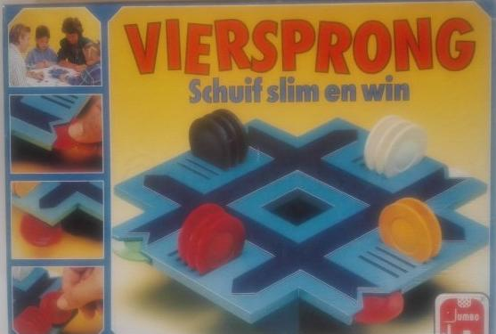
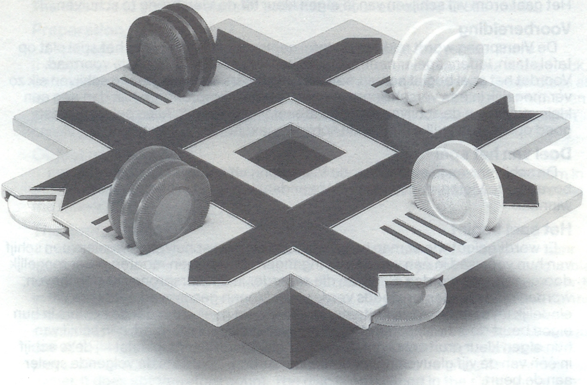

# viersprong

Game 'Viersprong' by Jumbo.

## Game rules

From [spelregels](spelregels.pdf):

### Spelregels

Viersprong is een spel voor 3 of 4 personen. De spelers duwen om beurten een
schijf in "de Viersprong”. Als de Viersprong vol is vallen er ook weer schijven uit.
Het gaat erom vijf schijven van je eigen kleur uit de Viersprong te schuiven.
Voorbereiding

De Viersprong wordt midden op tafel geplaatst en blijft tijdens het spel plat op
tafel staan. Iedere speler neemt 12 schijven van één kleur. Dit is de voorraad.
Voordat het spel begint schuift én van de spelers de twee groene schijven elk zo
ver mogelijk in een verschillende ingang van de Viersprong. Je kan dan nog een
klein stukje van de schijven zien. Zie afbeelding op pag.8 Alle spelers moeten
goed opletten in welke ingang de schijven geschoven worden.

### Doel van het spel

De schijven van je eigen kleur de Viersprong uit schuiven en in de gleuven
bovenop de Viersprong plaatsen. Wie er daar het eerst vijf heeft staan is de
winnaar.

### Het spel begint

Er wordt geloot wie er mag beginnen. Om beurten schuiven de spelers een schijf
van hun voorraad in één van de vier ingangen. De schijven moeten zover mogelijk
doorgeschoven worden. Schijven die al eerder in de Viersprong zijn geschoven,
worden op deze manier steeds verder naar binnen geschoven, totdat ze uit-
eindelijk uit één van de vier uitgangen vallen. Het gaat erom dat de spelers in hun
eigen beurt door het inschuiven van een schijf uit hun voorraad, een schijf van
hun eigen kleur eruit schuiven. Als een speler hierin slaagt, plaatst hij deze schijf
in één van de vijf gleuven bovenop de Viersprong. Daarna is de volgende speler
aan de beurt.
Als een speler een schijf van een andere speler uit de Viersprong schuift, geeft hij
deze aan de eigenaar terug. Deze telt dus niet mee. Deze schijf wordt dan ook
niet in de gleuven bovenop de baan geplaatst, maar bij de voorraad gelegd.
Wanneer een speler een groene schijf de baan uitschuift, dan moet hij één schijf
van zijn schijven op de Viersprong terugnemen bij zijn voorraad. In zijn volgende
beurt moet hij de groene schijf weer in de baan schuiven. Hij mag in die beurt
geen schijf van zijn eigen kleur spelen. Het is belangrijk, dat de spelers de plaats
en richting van de groene schijven in de Viersprong proberen te onthouden.
Zodra een speler erin slaagt de vijfde schijf bovenop de Viersprong te plaatsen, is
het spel afgelopen.
